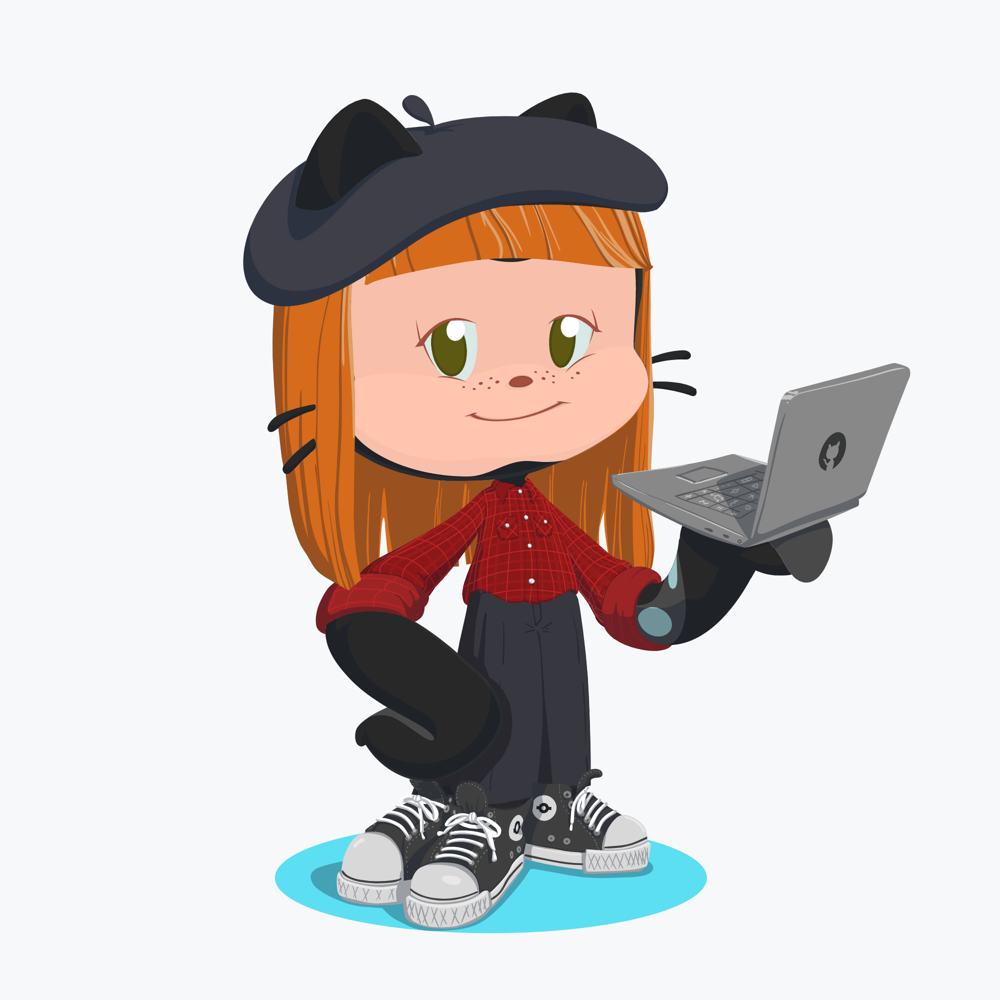

<h3> ✨ 🇧🇷  Hey, I'm Jhey! A passionate frontend developer from Brazil. 🇧🇷 ✨ </h3>

- 🔭 I’m currently working at [Objetiva Digital](http://novo.objetiva.digital/)

- 🌱 I’m currently learning and working with **React Js / Native**

- ✨ I’m looking to collaborate more on **open source projects**!

- 💬 Ask me about **animes, games, food and music 🖤**

- 📫 You can reach me in **jheyvilvok@gmail.com**

- ⚡ Fun fact **I'm obsessed with my giant dino onesie 🦖 💕**

<h3 align="left">Connect with me:</h3>

<h3 align="left">Languages and Tools:</h3>

          

&nbsp;

